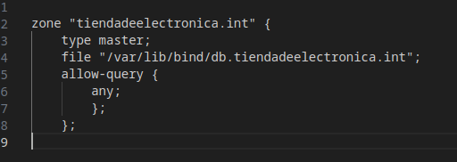
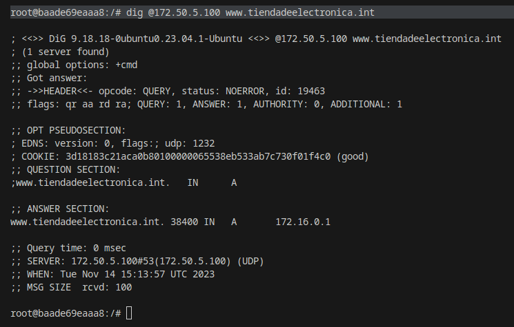
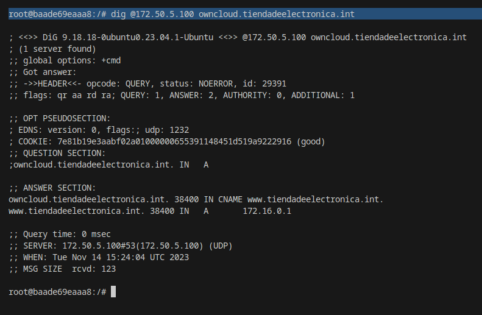
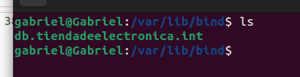
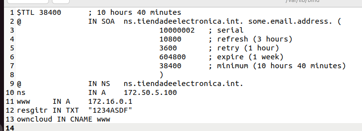
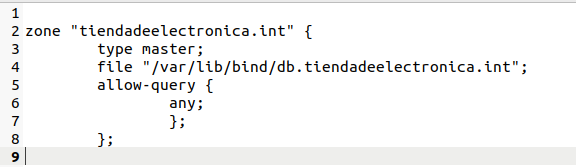
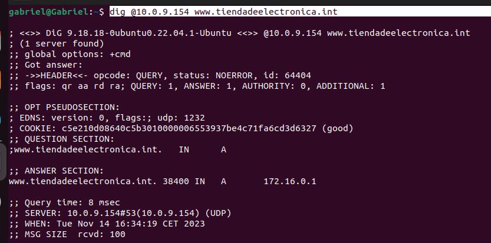
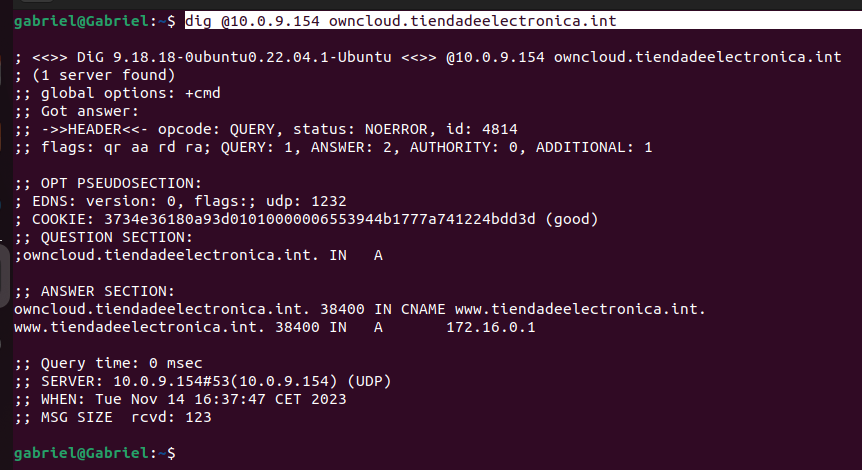

## 1. Explica métodos para 'abrir' una consola/shell a un contenedor que se está ejecutando

Se puede hacer de 2 formar:

- Haciendo click derecho sobre el contenedor en Visual Code y seleccionando "Attach Shell"
- O lanzando el siguiente codigo en la terminal:
    
        docker exec nombre_contenedor bash

## 2. En el contenedor anterior con que opciones tiene que haber sido arrancado para poder interactuar con las entradas y salidas del contenedor

Con los parámetros "-it"

**Ejemplo:**

        docker start -it nombre_contenedor

## 3. ¿Cómo sería un fichero docker-compose para que dos contenedores se comuniquen entre si en una red solo de ellos?

Habría que escribir en el docker compose el apartado "networks" especificando así la red que se desea utilizar

**Ejemplo:**

        networks:
                asir_bind9_subnet:
                external: true

## 4. ¿Qué hay que añadir al fichero anterior para que un contenedor tenga la IP fija?

En el docker compose al contenedor se le asigna una ip mediante el uso de "networks"

**Ejemplo:**

        networks:
                asir_bind9_subnet:
                ipv4_address: 172.50.5.100

## 5. ¿Que comando de consola puedo usar para saber las ips de los contenedores anteriores? Filtra todo lo que puedas la salida.

Utilizando el siguiente comando:

        docker network inspect nombre_de_red

## 6. ¿Cual es la funcionalidad del apartado "ports" en docker compose?

Es para mapear los puertos que expondremos al exterior con los puertos de nuestra máquina

## 7. ¿Para que sirve el registro CNAME? Pon un ejemplo

CNAME es el nombre canónico de un dominio. 

Por ejemplo google.com tiene 8.8.8.8 como DNS. Si se hace un CNAME a dicho dominio nos devolverá "google.com" como respuesta

## 8. ¿Como puedo hacer para que la configuración de un contenedor DNS no se borre si creo otro contenedor?

Una de las opciones sería crear carpetas en el anfitrión y mapearlas con los directorios del contedor en la configuración de los volumenes en el docker

## 9. Añade una zona tiendadeelectronica.int en tu docker DNS que tenga 

Primer se ha de crear un archivo llamado **"tiendadeelectronica.int"** en la carpeta **/var/lib/bind** y luego modificar los archivos de configuración

Una vez hecho eso podemos configurar las zonas

Podemos comprobar que funciona al utiliza dig

Podemos comprobar los logs haciendo click derecho en el contenedor y seleccionando "View logs"

## 10. Realiza el apartado 9 en la máquina virtual con DNS

Primero se ha de instalar el bind9 utilizando el siguiente comando

        sudo apt install bind9

Se puede comprobar que funciona utilizado:

        systemctl status bind9

Luego, dentro de /var/lib/bind se crea el fichero **"db.tiendadeelectronica.int"**

De igual forma como en el paso anterior se modifican los ficheros de configuracion y se definen las zonas

Una vez mas se comprueba con el dig

